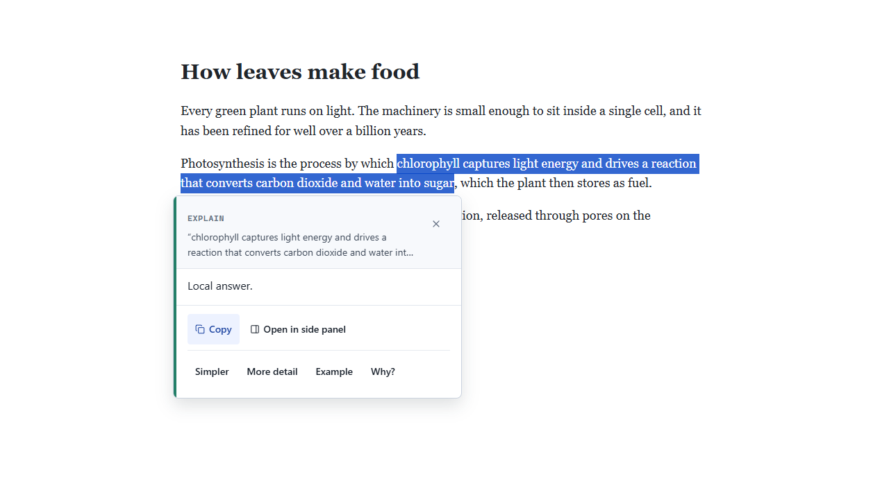
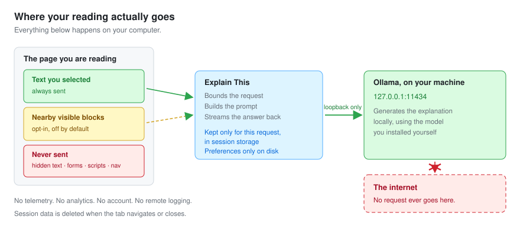
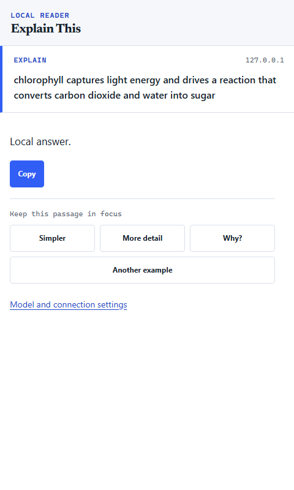
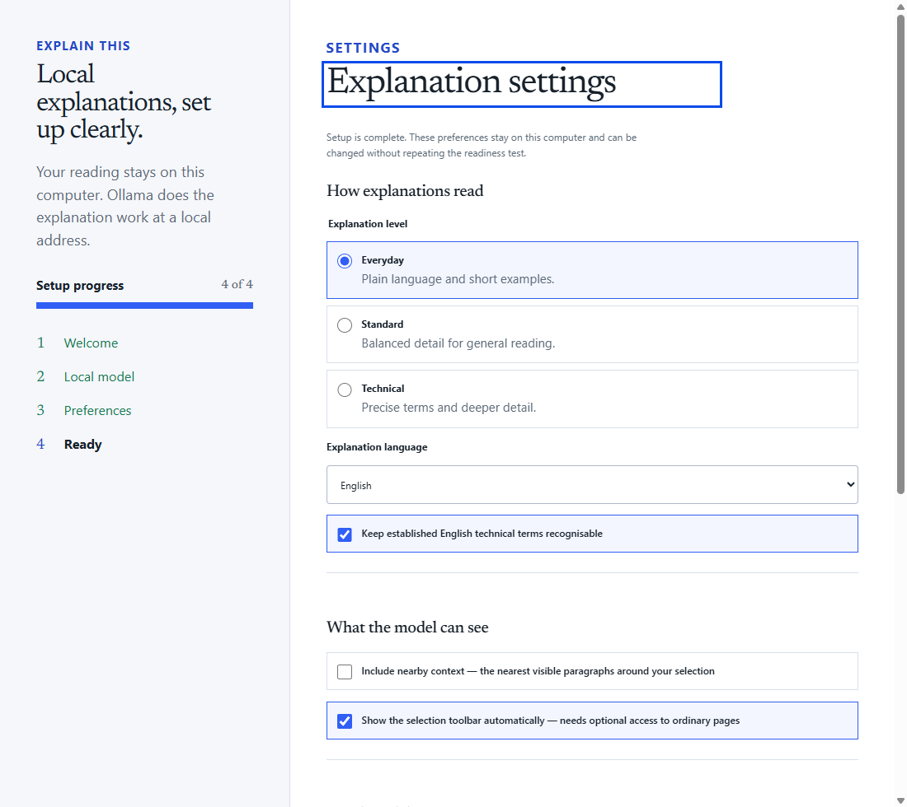

# Explain This

Understand anything you read, without leaving the page.

Select a passage, press a shortcut, and get a plain-language explanation from a model you
choose during setup: on your own machine by default, or on Ollama's cloud servers if you
opt in. No account, no telemetry. In the default mode, the text you read never leaves your
computer.



## Why this and not a translator or a chat sidebar

Translation tools convert words. They do not tell you what a sentence _means_ when the
words are already in your language and the idea is the hard part.

Generic AI sidebars can explain, but they send the page — or the whole tab — to someone
else's server, and they answer in a chat window that pulls you away from what you were
reading.

Explain This does one job: it explains the passage you selected, in place, using the model
you chose at setup. Four actions, four follow-ups, no chat box.

## Privacy promise

Where your reading goes depends on the mode you choose during setup.

| Mode             | Where your selected text goes                                  |
| ---------------- | -------------------------------------------------------------- |
| On this computer | Nowhere. The model runs locally through Ollama.                |
| Ollama Cloud     | To Ollama's servers. Ollama states that it does not retain it. |

The default is **On this computer**. Nothing changes mode without you choosing it in setup
or in Settings.

- Only the text **you select** is sent. Nearby context is opt-in and **off by default**.
- Page text and model output are **never written to persistent storage**.
- No telemetry, no analytics, no account.

The exact data inventory — every item, where it goes, how long it lives, and what you
control — is in [`docs/privacy.md`](docs/privacy.md).



## Requirements

|                  |                                                               |
| ---------------- | ------------------------------------------------------------- |
| Browser          | Chrome or a Chromium browser, version 116 or later            |
| Operating system | Windows, macOS, or Linux                                      |
| Runtime          | [Ollama](https://ollama.com), **installed separately by you** |
| Model            | `gemma3:4b`, about 3.3 GB on disk                             |
| Hardware         | Works without a GPU; a GPU makes it considerably faster       |

**Ollama is not bundled and is not installed for you.** This extension will never download,
start, or update it.

## Install

1. Install [Ollama](https://ollama.com) and start it.
2. Pull the model:

   ```bash
   ollama pull gemma3:4b
   ```

3. Install the extension, then open its options page and follow setup. It checks that
   Ollama is reachable, confirms the model, and asks for your reading preferences.

Setup never sends page text. The readiness check only lists your local models.

### Model choice and performance

`gemma3:4b` is the default because it answers directly, fits the response budget, and is
the only model measured here that stays usable across the European languages this
extension targets. Smaller alternatives such as `qwen2.5:3b-instruct` are faster and half
the size, but in evaluation they produced invented words rather than sentences in Dutch,
Polish, Swedish and Greek.

Translation is never authoritative. Every model measured here, `gemma3:4b` included,
occasionally alters numbers or drops a negation while reading fluently — the kind of error
you cannot see if you do not know the source language. Check anything legal, medical, or
financial against the original.

Avoid **reasoning models** such as `qwen3:4b` for this job. They narrate their own
deliberation before answering and are cut off by the output limit before reaching the
answer — in evaluation, that produced an unusable result in all 25 cases.

On a CPU-only machine expect roughly one second for a short explanation and a few seconds
for a longer technical one. The first request after the model loads is slower.

## Using it

**Select text**, then either:

- press <kbd>Alt</kbd>+<kbd>Shift</kbd>+<kbd>E</kbd>,
- right-click and choose **Explain This**, or
- use the selection toolbar, if you granted optional page access.

Pick an action:

| Action                         | What it does                                                    |
| ------------------------------ | --------------------------------------------------------------- |
| **Explain**                    | Explains the passage at your chosen level                       |
| **Simplify**                   | Rewrites it in plainer language without losing facts            |
| **Translate** _(experimental)_ | Translates into your preferred language — see the warning below |
| **Give an example**            | One concrete example that makes the passage land                |

The answer streams into a card next to your selection. From there you can **Stop**,
**Copy**, **Try again**, or **Open in side panel** for a roomier view, and ask a follow-up:
_Simpler_, _More detail_, _Why?_, or _Another example_.



> **Translate is experimental.** Every 3B-class model evaluated produced flawed
> translations — invented words, and in some cases characters from an entirely different
> script. Do not rely on it for anything that matters.

## Permissions, and why each one exists

| Permission                                             | Why                                                                             |
| ------------------------------------------------------ | ------------------------------------------------------------------------------- |
| `activeTab`                                            | Read your selection in the current tab, when you invoke the extension           |
| `contextMenus`                                         | Add the right-click menu                                                        |
| `scripting`                                            | Inject the reader surface on demand                                             |
| `sidePanel`                                            | Open the side panel                                                             |
| `storage`                                              | Save your preferences locally                                                   |
| `http://127.0.0.1:11434/*`, `http://localhost:11434/*` | Talk to your local Ollama — the only **required** host access                   |
| `http://*/*`, `https://*/*`                            | **Optional, off unless you grant it.** Only for the automatic selection toolbar |

Declining optional access costs you only the automatic toolbar. The shortcut and context
menu keep working.

## Settings



Everything you choose during setup stays editable: explanation level (everyday, standard,
technical), the explanation language, whether to keep English technical terms, whether to
include **nearby context**, whether the selection toolbar appears automatically, and a list
of hostnames where it stays off.

Changing the model or the Ollama connection runs setup again from the runtime check, so the
readiness test still guards what you switch to.

**Nearby context** is off by default. When on, the extension may include the nearest
visible reading blocks around your selection — never hidden text, form values, scripts,
navigation, or distant page content.

## Architecture

A background service worker owns the model connection, prompts, budgets, and storage. The
page-side reader renders results inside a Shadow DOM and never talks to the model. One
explanation runs at a time.

Full detail in [`docs/architecture.md`](docs/architecture.md).

## Contributing

```bash
npm ci
npm run check
```

`npm run check` runs formatting, lint, typecheck, tests, the production build, and the
manifest and package verifiers. Browser tests run separately with `npm run test:e2e`.

Full setup, commands, and the testing strategy: [`CONTRIBUTING.md`](CONTRIBUTING.md).

## Testing

Unit, component and contract tests run against a deterministic fake Ollama server and
contact nothing. End-to-end tests drive the **packaged** extension in real Chromium,
covering onboarding, the reader flow, privacy guarantees, and error recovery.

An opt-in evaluation suite (`tests/evaluation/`) runs a versioned corpus of 25 original
cases against your real local model. It checks mechanical properties only; answer quality
is scored by hand against a documented rubric.

Browser-owned surfaces — the native context menu, the real keyboard accelerator, the
permission dialog, protected pages, incognito — are a manual checklist, not a claim of
automation.

## Limitations

- **Explanations can be wrong.** A small local model generates them and nothing verifies
  them.
- **Prompt injection is not prevented.** A hostile page can steer the model's wording. What
  is enforced: output cannot execute, and page text never leaves your device. See
  [`SECURITY.md`](SECURITY.md).
- **Translation is experimental**, as above.
- **Ollama must be installed and running.** The extension will not do it for you.
- Chrome blocks extensions on `chrome://` pages and the Chrome Web Store.

## Roadmap

Larger-model support for translation, more explanation levels, and additional local
providers. Ollama Cloud is already supported as an opt-in mode; see
[Privacy promise](#privacy-promise) for what that changes.

## Troubleshooting

Every error code, what it means, and what to check:
[`docs/troubleshooting.md`](docs/troubleshooting.md).

## Security

Report vulnerabilities privately — see [`SECURITY.md`](SECURITY.md).

## License

ISC. See [`LICENSE`](LICENSE).
