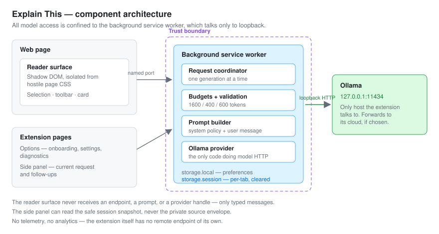

# Architecture

Explain This is a Chrome MV3 extension. All model work happens in a background service
worker; the page-side surface renders results and never talks to the model.



## Component boundaries

| Component                 | Runs in                   | Responsibility                                                          |
| ------------------------- | ------------------------- | ----------------------------------------------------------------------- |
| Background service worker | Extension worker          | Owns the provider, prompts, budgets, storage, and one global generation |
| Reader surface            | Page, inside a Shadow DOM | Selection capture, action toolbar, streamed response card               |
| Side panel                | Extension page            | Larger view of the _current_ request, plus follow-ups                   |
| Options page              | Extension page            | Onboarding state machine, preferences, diagnostics                      |
| Ollama provider           | Background worker         | The only code that performs model HTTP                                  |

The trust boundary is the service worker. Content scripts and extension pages exchange
typed messages over named ports; they never receive an endpoint, a prompt, or a provider
handle.

## Message flow

```text
selection -> reader surface -> named port -> background
                                               |- validate and enforce budgets
                                               |- build prompt (system + user)
                                               '- Ollama /api/chat (loopback, streamed)
                                                          |
reader surface <- delta / completed / failed <- request coordinator
```

Only one generation is active at a time, enforced by a concurrency gate. Starting a
request in another tab cancels the first and tells the first surface it was cancelled.

## Provider interface

The background depends on `LlmProvider`: `checkHealth`, `listModels`, `getModelDetails`,
and `streamChat`. Onboarding additionally uses `DownloadableModelProvider`, which adds
`downloadModel`. Everything else, including the evaluation runner, is typed against the
narrower interface, so downloading a model outside onboarding is impossible _by
construction_ rather than by policy.

`streamChat` yields a typed event stream: `started`, `delta`, `completed`, `cancelled`,
`failed`. Failures map to a closed set of public error codes; raw provider messages never
reach the UI.

### Timeouts

Ollama does not flush response headers until the model produces its first token, so on
`/api/chat` the wait for headers _is_ first-token latency, not connection latency. The
connection budget therefore applies to `/api/tags` and `/api/show`, which answer
immediately, while generation uses the first-token budget.

Getting this wrong is not cosmetic: it reports `CONNECTION_TIMEOUT`, which onboarding maps
to "Ollama is not running" — a misleading message for a model that is merely slow. On a
machine without a GPU the first token can take ten seconds or more.

## Temporary state

| Area              | Contents                                                    | Lifetime                                               |
| ----------------- | ----------------------------------------------------------- | ------------------------------------------------------ |
| `storage.local`   | Preferences and onboarding version only                     | Until changed                                          |
| `storage.session` | Reader session plus a private source envelope, keyed by tab | Until the tab navigates or closes, or the browser ends |

The side panel can read the safe session snapshot but never the private source envelope.

## MV3 lifecycle

The worker registers all listeners synchronously at top level so Chrome can restart it on
demand. Storage access restriction begins at startup. Because the worker can be evicted at
any time, no in-memory state is authoritative: session state lives in `storage.session`,
and cleanup is driven by the reader port lifecycle (`pagehide`, disconnect) plus
`tabs.onRemoved`. A broad `webNavigation` listener was deliberately avoided, because it
would require a browsing-metadata permission the privacy design does not want.

## Testing seams

The packaged extension is exercised in real Chromium against a fake Ollama server that
mirrors the real HTTP contract. Test-only affordances are compile-time constants, and the
build asserts they are physically absent from the production artifact rather than merely
disabled — a runtime flag could be switched on in a shipped package; a constant that
compiled away cannot.
